<h1 align="center">Hi there! I'm Dharwin S 👋</h1>

  

  

  

  
  
  
  

---

### 🙋‍♂️ About Me

I am a passionate **AI & Data Science Student** and **Full Stack Developer** who loves engineering smart, data-driven applications. I specialize in training machine learning models, building robust web architectures, and crafting responsive user experiences.

- 🎓 **Education:** Pursuing B.Tech in **Artificial Intelligence and Data Science** (2023 - 2027)
- 🏫 **Institution:** **Kongu Engineering College**, Tamil Nadu, India
- 📈 **Academic Performance:** Current CGPA of **8.11**
- 💡 **Interests:** Machine Learning, Natural Language Processing, Full Stack Web Development, and Algorithmic Problem Solving.
- ✍️ **Philosophy:** I enjoy taking complex real-world problems and breaking them down into clean, scalable, and efficient code.

---

### 🛠️ Tech Stack

I work with a variety of programming languages, frameworks, and developer tools to bring ideas to life.

<table>
  <tr>
    <td width="30%" valign="top"><strong>💻 Programming</strong></td>
    <td width="70%"></td>
  </tr>
  <tr>
    <td width="30%" valign="top"><strong>🌐 Frontend</strong></td>
    <td width="70%"></td>
  </tr>
  <tr>
    <td width="30%" valign="top"><strong>⚙️ Backend &amp; DBs</strong></td>
    <td width="70%"></td>
  </tr>
  <tr>
    <td width="30%" valign="top"><strong>🤖 AI/ML &amp; Data Science</strong></td>
    <td width="70%">
      
       
      <em>Also experienced in: Scikit-Learn, Matplotlib</em>
    </td>
  </tr>
  <tr>
    <td width="30%" valign="top"><strong>🛠️ Developer Tools</strong></td>
    <td width="70%">
      
       
      <em>Also experienced in: Azure AI Services</em>
    </td>
  </tr>
</table>

---

### 🚀 Featured Projects

Here are some of the key projects I have built. They reflect my passion for integrating machine learning with practical, user-facing applications.

<table width="100%">
  <tr>
    <td width="50%" valign="top">
      <h4>🏡 AI-Powered House Planning &amp; Groundwater Insights</h4>
      
An intelligence platform providing land-quality analysis, groundwater depth prediction, climate forecasting, and automatic generative blueprint creation.

      

        
        
        
        
        
      

    </td>
    <td width="50%" valign="top">
      <h4>🏥 Healthcare Management System</h4>
      
A comprehensive web portal streamlining medical operations, incorporating high-fidelity video consultations, real-time doctor-patient chats, and a specialized AI healthcare chatbot.

      

        
        
        
        
      

    </td>
  </tr>
  <tr>
    <td width="50%" valign="top">
      <h4>🛒 SuperMarket Management System</h4>
      
An enterprise-grade administrative dashboard showcasing automated customer billing, dynamic PDF invoice generation, and interactive visual sales analytics.

      

        
        
        
        
      

    </td>
    <td width="50%" valign="top">
      <h4>🌋 Earthquake Prediction System</h4>
      
A machine learning-driven analytics application that processes historical seismic sensor datasets to classify, forecast, and visualize earthquake patterns.

      

        
        
        
        
      

    </td>
  </tr>
</table>

---

### 🏆 Achievements & Certifications

<table width="100%">
  <tr>
    <td width="50%" valign="top">
      <h4>🥇 Key Achievements</h4>
      <ul>
        <li>💼 <strong>Generative AI Internship</strong> (2025) - Worked on implementing advanced LLM pipelines.</li>
        <li>💻 <strong>HackSphere '25 Participant</strong> - Developed creative technical prototypes under strict deadlines.</li>
        <li>🔬 <strong>Ruby Year Project Expo 2025</strong> - Shortlisted in the top projects for innovative ideas.</li>
      </ul>
    </td>
    <td width="50%" valign="top">
      <h4>📜 Professional Certifications</h4>
      <ul>
        <li>☁️ <strong>Microsoft Certified: Azure AI Engineer Associate (AI-102)</strong></li>
        <li>🍃 <strong>MongoDB Certified Associate Developer</strong></li>
        <li>📊 <strong>Oracle APEX Certification</strong></li>
      </ul>
    </td>
  </tr>
</table>

---

### 📊 GitHub & Programming Metrics

Here are my live development stats:

<table width="100%" align="center">
  <tr>
    <td width="50%" align="center" valign="top">
      
    </td>
    <td width="50%" align="center" valign="top">
      
    </td>
  </tr>
  <tr>
    <td width="50%" align="center" valign="top">
      
    </td>
    <td width="50%" align="center" valign="top">
      
    </td>
  </tr>
</table>

#### 📈 Git Activity Graph

  

---

### 🤝 Connect With Me

Let's discuss technology, projects, or potential collaborations!

- 🌐 **Personal Website:** [dharwin.tech](https://dharwin.tech)
- 💼 **LinkedIn:** [Dharwin S](https://linkedin.com/in/dharwin-s)
- 📧 **Direct Email:** [dharwinsangamani@gmail.com](mailto:dharwinsangamani@gmail.com)
- 👨‍💻 **GitHub:** [@Dharwin77](https://github.com/Dharwin77)

  <em>Last updated: June 2026</em>

