<p align="center">
  
</p>

<p align="center">
  
</p>


<p align="center">
  
</p>

<!-- Social Media Badges -->
<p align="center">
  <a href="https://dharwin.tech/" target="_blank">
    
  </a>
  <a href="https://linkedin.com/in/dharwin-s" target="_blank">
    
  </a>
  <a href="https://leetcode.com/u/dharwins/" target="_blank">
    
  </a>
  <a href="mailto:dharwinsangamani@gmail.com">
    
  </a>
</p>


---

## ─── 🙋‍♂️ ABOUT ME ───

I am an **AI & Data Science Student** and **Full Stack Developer** specializing in building smart web systems and machine learning pipelines. My focus is on writing clean, optimized, and performant code that bridges data-driven models with clean user interfaces.

<details open>
  <summary><b>⚡ developer_profile.sh --status</b></summary>
  <br/>

```yaml
Status      : Active 🟢
Academic    : B.Tech in AI & Data Science (2023 - 2027)
Institution : Kongu Engineering College, Erode, India
CGPA        : 8.11 / 10.0
Mission     : Engineering scalable software to solve complex tasks
```
</details>

<details>
  <summary><b>🧠 Specialized Focus & Focus Areas</b></summary>
  
> [!NOTE]
> * **Generative AI:** Building LLM agent workflows, fine-tuning, and RAG architectures.
> * **Data Modeling:** Predictive data modeling, pipeline design, and OpenCV computer vision.
> * **Web Systems:** Designing real-time Socket.io systems, FastAPI backends, and React interfaces.
</details>

---

## ─── 🛠️ TECH STACK ───

My toolbelt covers frontend design, server architectures, databases, and AI modeling frameworks.

> [!IMPORTANT]
> ### 
> <br/>
>
> [](https://github.com/Dharwin77)
> [](https://github.com/Dharwin77)
> [](https://github.com/Dharwin77)
> [](https://github.com/Dharwin77)
> [](https://github.com/Dharwin77)
> [](https://github.com/Dharwin77)
> [](https://github.com/Dharwin77)

> [!NOTE]
> ### 
> <br/>
>
> [](https://github.com/Dharwin77)
> [](https://github.com/Dharwin77)
> [](https://github.com/Dharwin77)
> [](https://github.com/Dharwin77)
> [](https://github.com/Dharwin77)
> [](https://github.com/Dharwin77)
> [](https://github.com/Dharwin77)
> [](https://github.com/Dharwin77)
> [](https://github.com/Dharwin77)
> [](https://github.com/Dharwin77)
> [](https://github.com/Dharwin77)
> [](https://github.com/Dharwin77)

> [!TIP]
> ### 
> <br/>
>
> [](https://github.com/Dharwin77)
> [](https://github.com/Dharwin77)
> [](https://github.com/Dharwin77)
> [](https://github.com/Dharwin77)


---

## ─── 🚀 FEATURED PROJECTS ───

A showcase of applications showing ML integrations with robust web frameworks.

<table width="100%">
  <tr>
    <td width="50%" valign="top">
      <h4>🏡 AI-Powered House Planning &amp; Groundwater Prediction</h4>
      <p>A smart system providing land-suitability reviews, groundwater depth predictions, climate forecasting, and automated generative architectural blueprints.</p>
      <p>
        
        
        
        
      </p>
      <hr style="border: 0.5px solid #334155" />
      <p align="right">
        <a href="https://github.com/Dharwin77" target="_blank">📂 Codebase</a>
      </p>
    </td>
    <td width="50%" valign="top">
      <h4>🏥 Interactive Healthcare Portal</h4>
      <p>A web framework supporting telemedicine workflows: live peer-to-peer video consultations, active doctor-patient text channels, and an AI chatbot assistant.</p>
      <p>
        
        
        
        
      </p>
      <hr style="border: 0.5px solid #334155" />
      <p align="right">
        <a href="https://github.com/Dharwin77" target="_blank">📂 Codebase</a>
      </p>
    </td>
  </tr>
  <tr>
    <td width="50%" valign="top">
      <h4>🛒 SuperMarket Billing &amp; Analytics Dashboard</h4>
      <p>An administrative software suite designed for automated checkouts, dynamic PDF invoice generation, and interactive charts displaying monthly sales metrics.</p>
      <p>
        
        
        
      </p>
      <hr style="border: 0.5px solid #334155" />
      <p align="right">
        <a href="https://github.com/Dharwin77" target="_blank">📂 Codebase</a>
      </p>
    </td>
    <td width="50%" valign="top">
      <h4>🌋 Earthquake Prediction &amp; Modeling System</h4>
      <p>A machine learning environment built to run regression analysis on seismic datasets to predict earthquakes and plot visual heatmaps.</p>
      <p>
        
        
        
      </p>
      <hr style="border: 0.5px solid #334155" />
      <p align="right">
        <a href="https://github.com/Dharwin77" target="_blank">📂 Codebase</a>
      </p>
    </td>
  </tr>
</table>

---

## ─── 🏆 ACHIEVEMENTS & CERTIFICATIONS ───

<p align="center">
  
</p>

<details>
  <summary><b>📜 View Plain Text Achievements &amp; Certifications</b></summary>
  <br/>

*   🥇 **Generative AI Internship (2025):** Built and deployed fine-tuned LLM agents.
*   💻 **HackSphere '25 Hackathon:** Developed fully functioning prototype integrations in a 24h hackathon.
*   🔬 **Ruby Year Project Expo 2025:** Top-shortlisted project for AI architectural tools.
*   ☁️ **Microsoft Azure AI Engineer Associate (AI-102)**
*   🍃 **MongoDB Certified Associate Developer**
*   📊 **Oracle APEX Professional**
</details>


---

## ─── 📊 METRICS & ANALYTICS ───

Dynamic development dashboard summarizing active git statistics:

<table width="100%">
  <tr>
    <td width="50%" align="center">
      
    </td>
    <td width="50%" align="center">
      
    </td>
  </tr>
  <tr>
    <td width="50%" align="center">
      
    </td>
    <td width="50%" align="center">
      
    </td>
  </tr>
</table>

#### 📈 Interactive Contribution Pulse
<p align="center">
  
</p>

---

## ─── 🤝 CONNECT WITH ME ───

I'm always open to discussing new projects, internships, or open-source collaborations. Feel free to reach out!

* 🌐 **Personal Website:** [dharwin.tech](https://dharwin.tech)
* 💼 **LinkedIn Profile:** [/in/dharwin-s](https://linkedin.com/in/dharwin-s)
* 📧 **Direct Inbox:** [dharwinsangamani@gmail.com](mailto:dharwinsangamani@gmail.com)
* 👨‍💻 **GitHub Profile:** [@Dharwin77](https://github.com/Dharwin77)

<p align="right">
  <i>Last Synchronized: June 2026</i>
</p>
